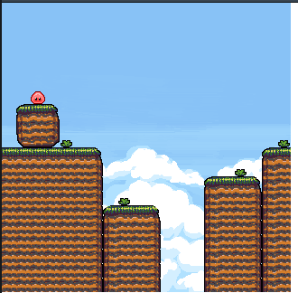
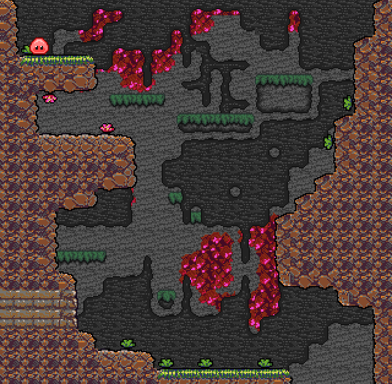

# LDjam48

Goop's Adventure
GAME by n-c0de-r and blome
This was our first enrty at the LDjam. We did this just for fun, no big plans were laid out.

As total beginners, and with almost no special preparation before at all, we did not finish much, but learned a lot. The game was supposed to be a simple platfromer with some terrain-related movement mechanics. While searching for assets we found this little slime sprite and it gave us some ideas. It’s totally unfinished, has only two demo levels (switch with SHIFT KEY), and no sound so far.

We will come back again, and might even continue to work on this very same project in the meantime.

SOURCES All assets were taken from OpenGameArt.org. We modified all of them to fit our needs.

Slime monster by Bonsaiheldin https://opengameart.org/content/slime-monster-24x24

Jungle Dirt & Background [Connecting Tileset] [16x16] by KnoblePersona https://opengameart.org/content/jungle-dirt-background-connecting-tileset-16x16

some tiles by vk https://opengameart.org/content/some-tiles

Sky background by PauR https://opengameart.org/content/sky-background
